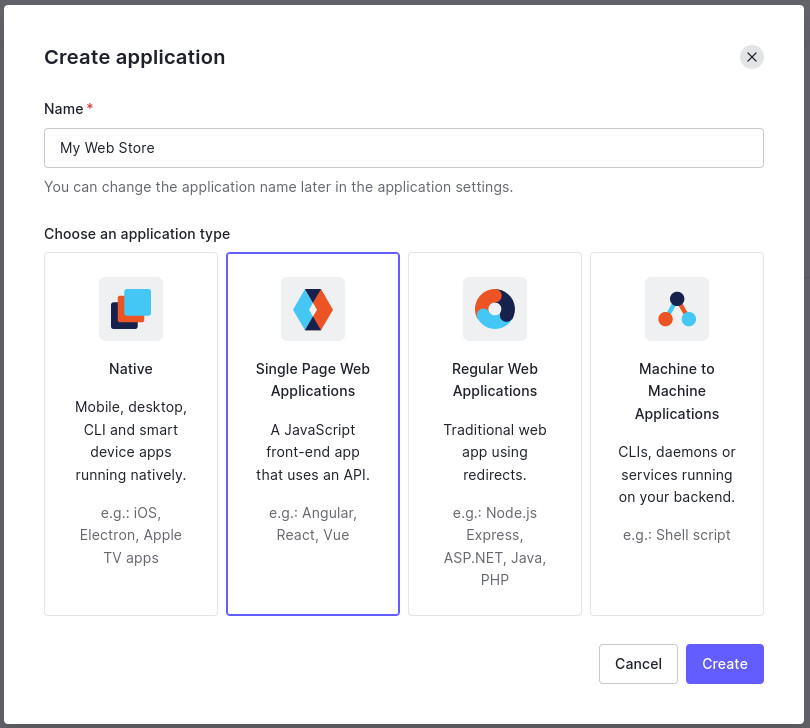
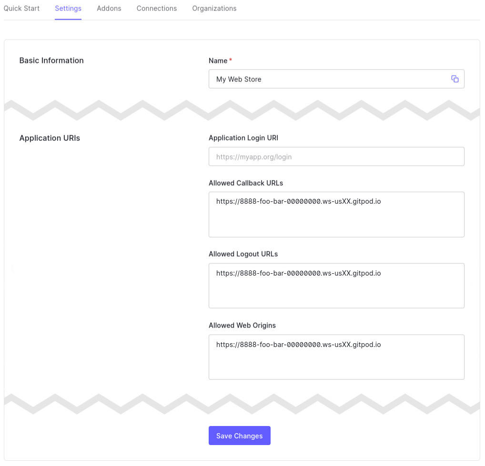

# Write Your Own Web Store In Hours


## Authenticating Users

In order to allow users to log in and see past orders, we need to make sure all orders are places by authenticated users. Let's add Auth0 to our web store.


## Create an application in your Auth0 Dashboard

In the Auth0 dashboard, [create a new Application](https://manage.auth0.com/#/applications), and make sure you make it of type "Single Page Web Application".

> 📷 **_The Auth0 "Create Application" modal_**
>
> 


## Configure the application in Auth0

Once the application is set up in your Auth0 Dashboard, switch to the **Settings** tab. We need to tell Auth0 some things about our local development environment in order to make this work.

Add your local development URL to the **Allowed Callback URLs**, **Allowed Logout URLs**, and **Allowed web Origins** fields, and then scroll to the bottom of the page and **Save Changes** Assuming your local web store is running at http://localhost:8888, add this

> 📷 **_The URLs we need to set in the Auth0 Dashboard_**
>
> 

Essentially, this is telling Auth0 which web applications it's permitted to talk to about the authentication process.


## Install the Auth0 SDK for React

Auth0 provides a very easy to use SDK for many programming languages and tech stacks. The React one will make light work of integrating everything.

👉💻👈 Grab the latest SDK

```
npm install @auth0/auth0-react
```

👉💻👈 Edit `src/index.js` to wrap the entire application with the Auth0 Provider, and insert the following `import` directive, and wrap the `<App>` element as shown:

```
import { Auth0Provider } from '@auth0/auth0-react';
```

```
<Auth0Provider
    domain="YOUR_AUTH0_DOMAIN"
    clientId="YOUR_AUTH0_CLIENT_ID"
    redirectUri={window.location.origin}
>
    <App />
</Auth0Provider>
```

💡 But what are those two values in there? Switch back to the Settings tab in the Auth0 Dashboard, and you'll find the **DOMAIN** and **CLIENT ID** up near the top.

These are not sensitive values, but in an ideal world we'd split these out into a separate configuration file that we can exclude from the code repository. In the interest of not complicating this workshop any further, that's left as an exercise for the reader for another time 😁

> 📷 **_The Basic Settings for the application definition on the Auth0 dashboard_**
>
> 


## Show "Login" buttons if the user is not logged in

The Auth0 SDK provides lots of helper functionality. If we wanted to protect a whole page from unauthenticated users, for example, we could use the `withAuthenticationRequired()` higher order component to protect the page component. For example, to protect the homepage, you _could_ write:

```
export default withAuthenticationRequired(Home);
```

But, that's not what we want to do today. Instead, we want to detect the current user in the Home component. There are ac ouple of ways we can do this, but as it would make sense to turn the "Buy Now" button into a component that determines what it should do based on the user's logged in status, we'll use the `useAuth()` hook.

👉💻👈 Edit `/src/pages/home.js` and let's create a new component to contain the Buy Now button. Add the `import` directive and define the new component at the top, and replace the button in the main output with this new component:

```javascript
import { useAuth0 } from "@auth0/auth0-react";

const BuyNowButton = ({ product }) => {
  const { isLoading, isAuthenticated, loginWithRedirect } = useAuth0();

  const buy = () => {};

  if (isLoading) return <></>;

  if (isAuthenticated) return <button onClick={buy}>Buy Now</button>;

  return <button onClick={loginWithRedirect}>Log In To Purchase</button>;
};
```

```
<p className="buynow"><BuyNowButton product={product} /></p>
```

What we're doing here is to wait until the Auth0 provider has finished loading, at which point we know if there's a logged in user. If the user is logged in, we show the "Buy Now" button, otherwise we show the "Log In To Purchase" button.

Let's do something similar to add a Logout button to the menu if the user is logged in.

👉💻👈 Edit `/src/components/layout.js`. We need to import `useAuth0`, extract some methods from that, and then optionally display a logout button in the menu. To make it easier for you, here's what the final file should look like:

```javascript
import React from "react";
import { Link } from "react-router-dom";
import { useAuth0 } from "@auth0/auth0-react";

const Layout = ({ children }) => {
  const { isLoading, isAuthenticated, logout } = useAuth0();

  return (
    <>
      <header>
        <h1>My Web Store</h1>
        <nav>
          <ul>
            <li>
              <Link className="menuitem" to="/">
                Home
              </Link>
            </li>
            {!isLoading && isAuthenticated && (
              <li>
                <button className="menuitem" onClick={logout}>
                  Logout
                </button>
              </li>
            )}
          </ul>
        </nav>
      </header>
      <main>{children}</main>
    </>
  );
};

export default Layout;
```

🧪 Check out your local web store now - the buttons should have updated. They did? Well click it and create an account! When that's done, you'll see the buttons read "Buy Now" again.

💡 Note that the CSS file should style the Logout link very similarly to the menu item already 👍
